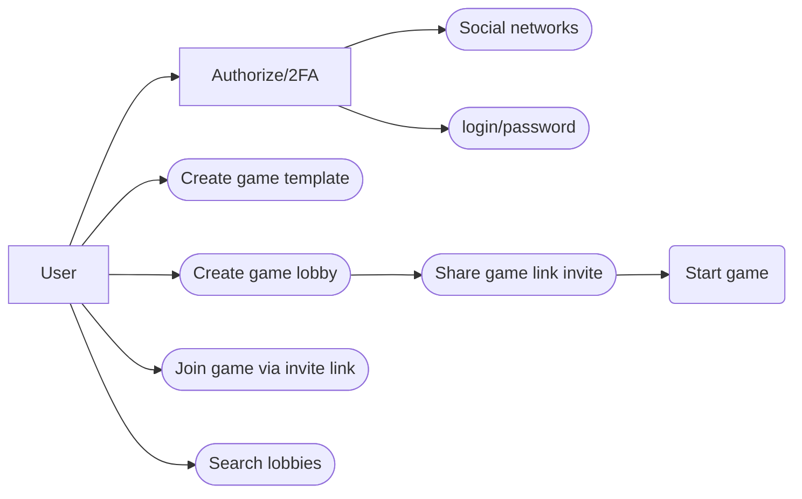
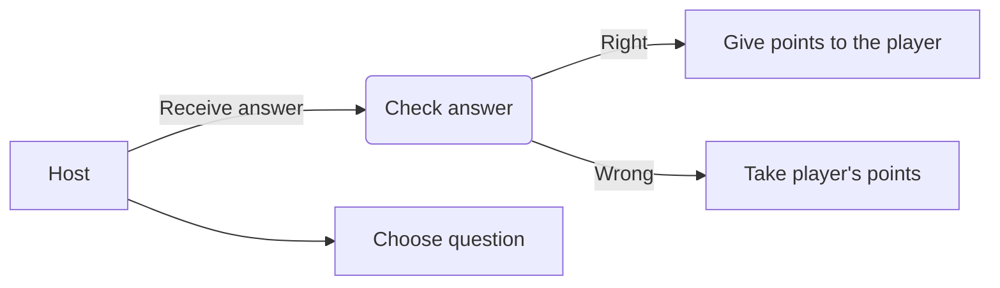

# Oyster Bay Express` SI Game
## Main concepts:
Our project is determined to renew and refactor existing web platform of well-known intellectual quiz game°.
MVP functionality is considered in:
- game templates creation
- lobby formation by sending the invitations
- game start and conducting with scores supplementing due to the host filtering the players answers

## Use cases diagram

## Technologies for implementing:
- Frontend: Angular
- Database: postgresql
- Backend: µwebsocket
- Testing: Jest/Jasmine
- ESLint, Prettier

° - the original rules [reference](https://ru.wikipedia.org/wiki/%D0%A1%D0%B2%D0%BE%D1%8F_%D0%B8%D0%B3%D1%80%D0%B0#%D0%9E_%D0%BF%D1%80%D0%BE%D0%B3%D1%80%D0%B0%D0%BC%D0%BC%D0%B5)
